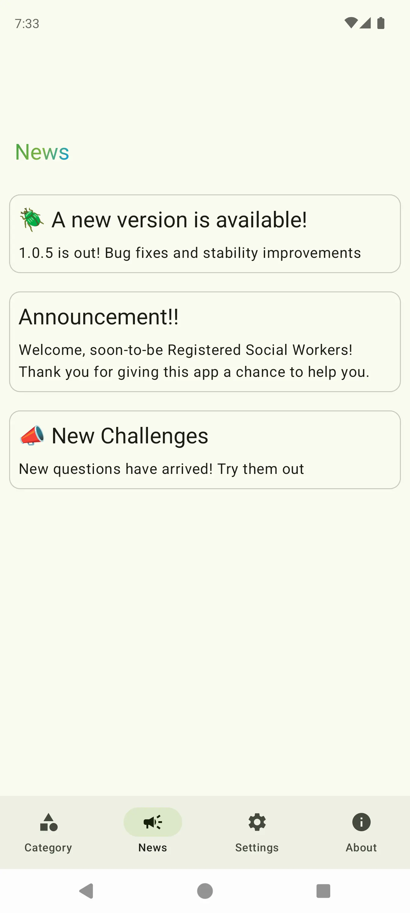
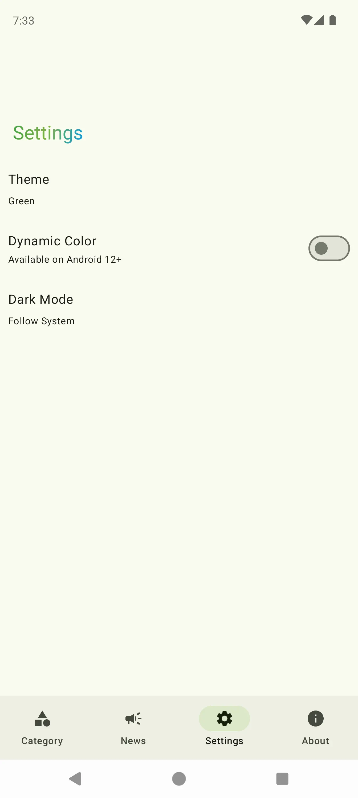
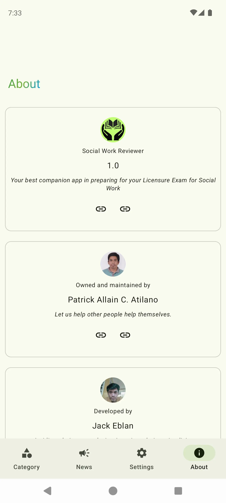
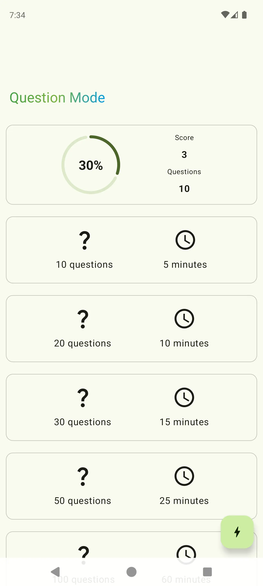
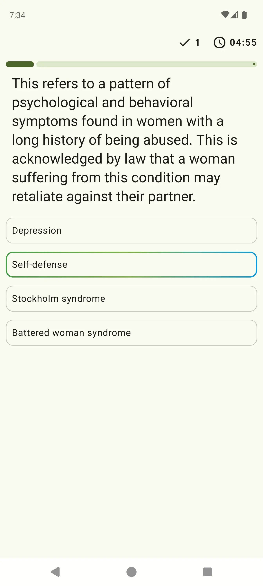
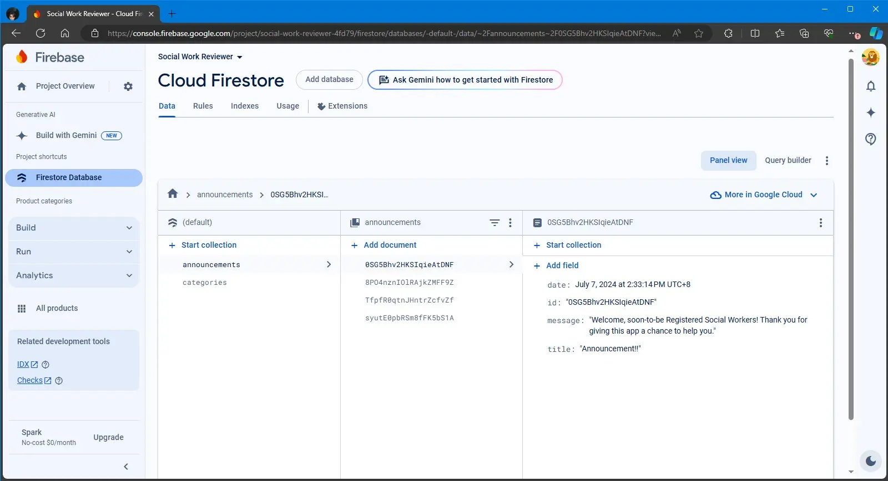
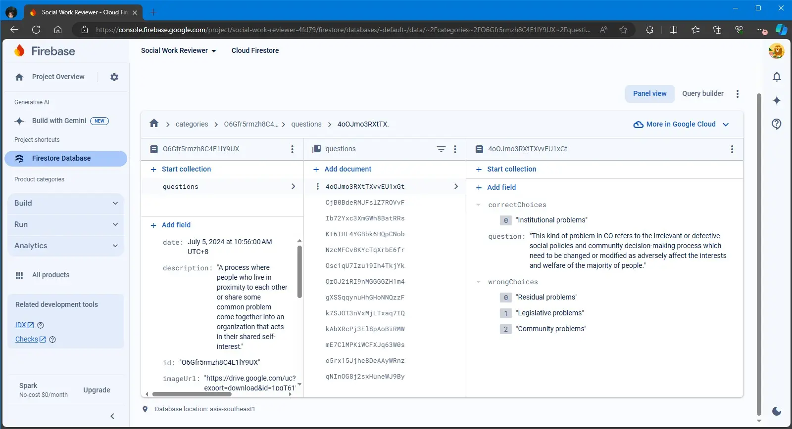
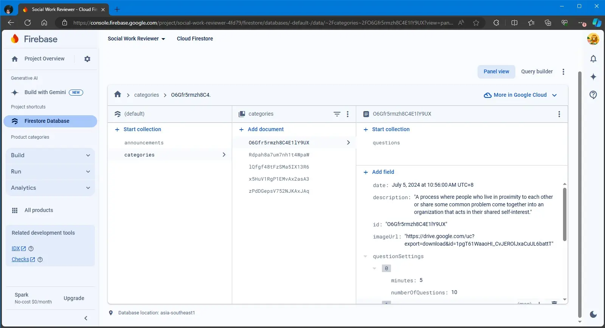

# Social Work Reviewer

The architecture and modularization of this project are inspired
from [Now in Android](https://github.com/android/nowinandroid). **The development of this
application is in progress 🚧**

- Uses Firestore Database to store the questions.
- Supports a single or multiple choices for each question.

# Screenshots

# Firestore Database

Refer to the images below to see how the database is structured.

